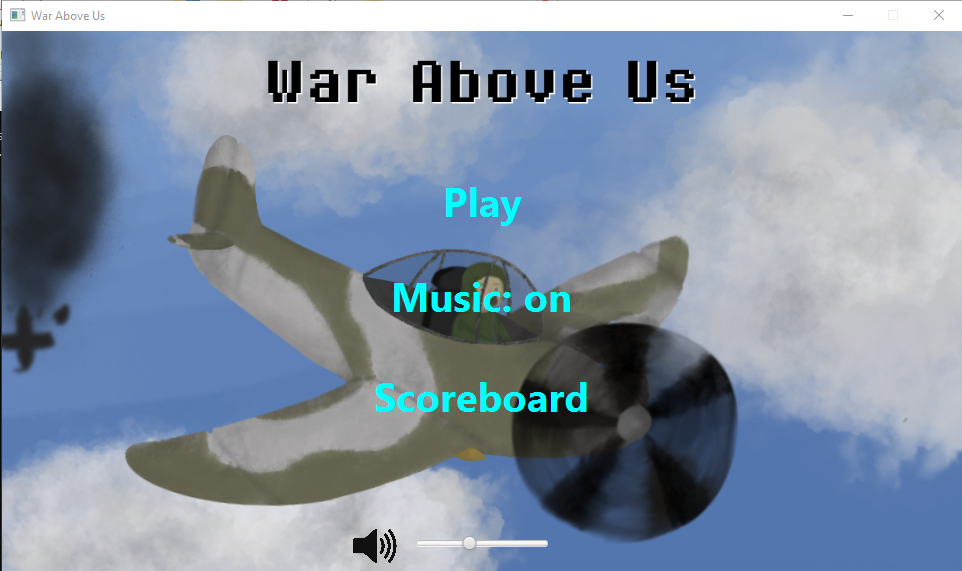
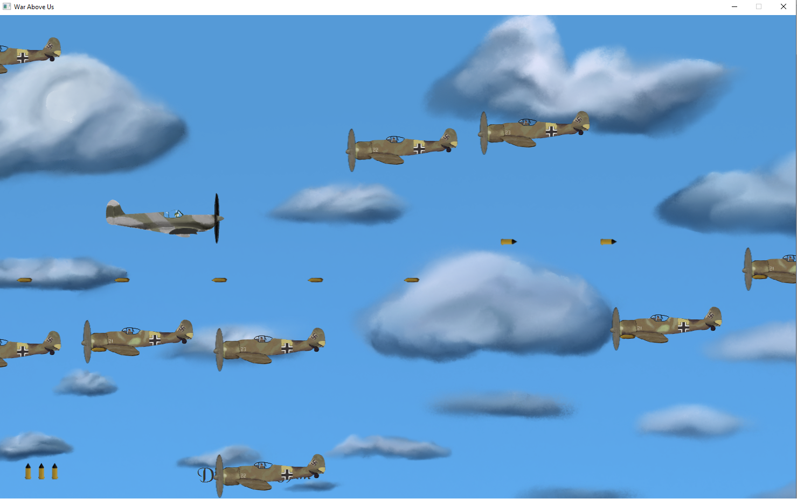
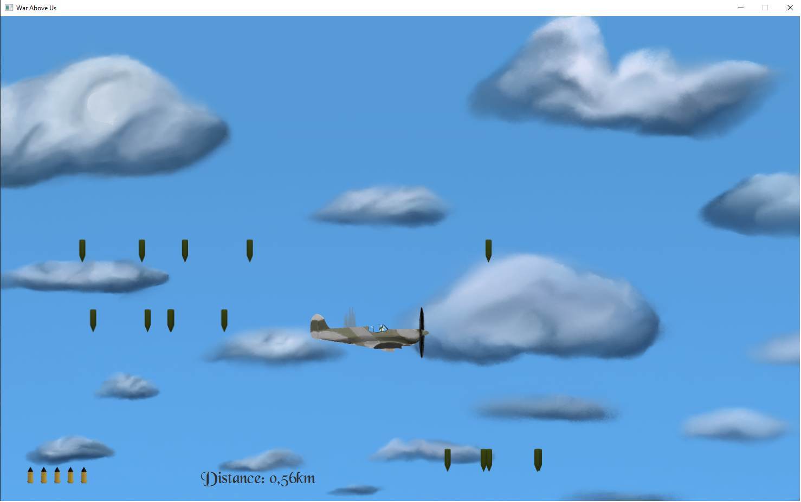
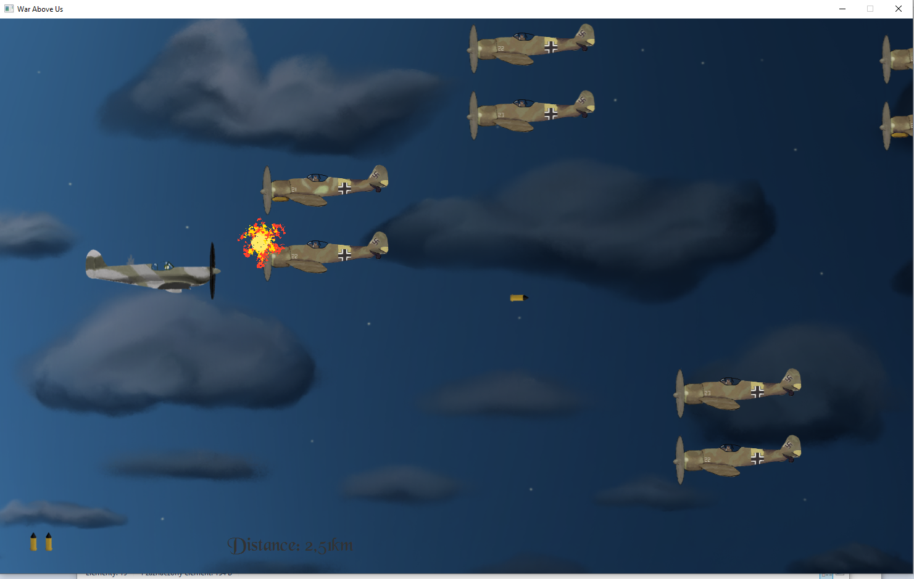
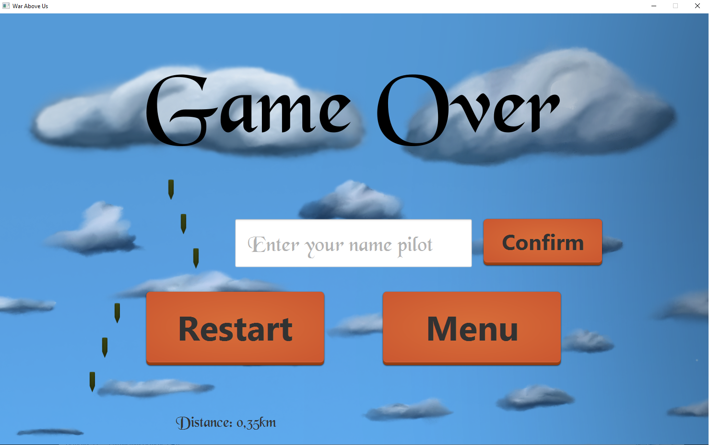

1. Download JavaFx from https://gluonhq.com/products/javafx/

2. Open ```run_WarAboveUs.bat``` in edit mode.

3. Set module-path to lib folder of downloaded JavaFx. Example:
```--module-path "E:\Programy\Java\javafx-sdk-21.0.5\lib"```

4. Save and exit

5. Finally run the application by executing ```run_WarAboveUs.bat```.

Production
- Programming - Michał Milej
- Graphics - Paulina Bodzon

Screenshots from the game:




